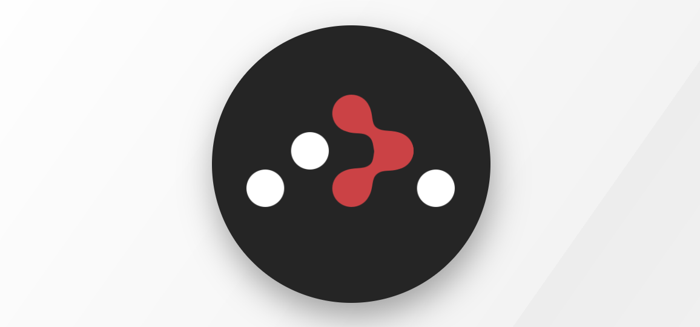

<!-- # Getting Started with Create React App

This project was bootstrapped with [Create React App](https://github.com/facebook/create-react-app).

## Available Scripts

In the project directory, you can run:

### `npm start`

Runs the app in the development mode.\
Open [http://localhost:3000](http://localhost:3000) to view it in the browser.

The page will reload if you make edits.\
You will also see any lint errors in the console.

### `npm test`

Launches the test runner in the interactive watch mode.\
See the section about [running tests](https://facebook.github.io/create-react-app/docs/running-tests) for more information.

### `npm run build`

Builds the app for production to the `build` folder.\
It correctly bundles React in production mode and optimizes the build for the best performance.

The build is minified and the filenames include the hashes.\
Your app is ready to be deployed!

See the section about [deployment](https://facebook.github.io/create-react-app/docs/deployment) for more information.

### `npm run eject`

**Note: this is a one-way operation. Once you `eject`, you can’t go back!**

If you aren’t satisfied with the build tool and configuration choices, you can `eject` at any time. This command will remove the single build dependency from your project.

Instead, it will copy all the configuration files and the transitive dependencies (webpack, Babel, ESLint, etc) right into your project so you have full control over them. All of the commands except `eject` will still work, but they will point to the copied scripts so you can tweak them. At this point you’re on your own.

You don’t have to ever use `eject`. The curated feature set is suitable for small and middle deployments, and you shouldn’t feel obligated to use this feature. However we understand that this tool wouldn’t be useful if you couldn’t customize it when you are ready for it.

## Learn More

You can learn more in the [Create React App documentation](https://facebook.github.io/create-react-app/docs/getting-started).

To learn React, check out the [React documentation](https://reactjs.org/).

### Code Splitting

This section has moved here: [https://facebook.github.io/create-react-app/docs/code-splitting](https://facebook.github.io/create-react-app/docs/code-splitting)

### Analyzing the Bundle Size

This section has moved here: [https://facebook.github.io/create-react-app/docs/analyzing-the-bundle-size](https://facebook.github.io/create-react-app/docs/analyzing-the-bundle-size)

### Making a Progressive Web App

This section has moved here: [https://facebook.github.io/create-react-app/docs/making-a-progressive-web-app](https://facebook.github.io/create-react-app/docs/making-a-progressive-web-app)

### Advanced Configuration

This section has moved here: [https://facebook.github.io/create-react-app/docs/advanced-configuration](https://facebook.github.io/create-react-app/docs/advanced-configuration)

### Deployment

This section has moved here: [https://facebook.github.io/create-react-app/docs/deployment](https://facebook.github.io/create-react-app/docs/deployment)

### `npm run build` fails to minify

This section has moved here: [https://facebook.github.io/create-react-app/docs/troubleshooting#npm-run-build-fails-to-minify](https://facebook.github.io/create-react-app/docs/troubleshooting#npm-run-build-fails-to-minify) -->

# BLJ 

###### Becky Louise Jones 🙋‍♀️ (me)

# 📖 Finley Stories 🎞️

## Why? :question:

This project started as at the beginning of lockdown my brother purchased a Tonies box. (This is a device which allows sounds to be played through a small figure placed on top of it. These can come in characters from tv shows/books or can be custom "Tonies").
 
 
https://tonies.com/en-gb/shop/?gclid=CjwKCAjwhMmEBhBwEiwAXwFoEUEr89CZtC4SMjx-zh9euUmX6iw5PDEEIoJdOCHtEXvlR_QdvqA21BoCdzAQAvD_BwE
 
 
My brother brought this as a way for distant family to stay close to my nephew (at the time only a few months old) as stories can be recorded on phones/tablets/devices and played through "Tonies" so Finley can hear their voices.
 
 
Recently my mom made a comment about wanting to record video stories so he can get to know her face as well as her voice.

## Bright Idea 💡

"If only there was somewhere to put them????" 🤔
 
 
So I made one 😄
 
 
The site has an area where stories can be added aswell as page that shows nursery rhymes. (Also added a music page after my brother showed a video of my nephew enjoying Alexa playing Lady Gaga - Bad Romance).

## How to use 🧑‍🎓

The site has 3 main areas that you can navigate to using the buttons.

### Stories 📚

On the stories page thumbnail images are displayed with the cover of the stories (like a library). Clicking on an image takes you to a page where the video of the story is available, sometimes with some facts and details as well.

### Nursery Rhymes 👶

On the nursery rhymes page thumbnail images are displayed with the cover of the stories (like a gallery). Clicking on an image takes you to a page where the video of the story is available also with the lyrics underneath as well.

###### 😠 Although the get dressed song is wrong 🙅 he puts his socks on last when they should be first  🧦 then 👖

### Music 🎶

On the music page it shows which tracks are available to play (at the moment as an mp3 file but looking into the idea of a playlist like spotify).

### Want to see :eyes:

If you want to see the site you can look on the link at the hosted version...
 
https://blj-finley-stories.netlify.app/

Or

Alternatively you can do the command npm run start in the terminal and a localhost version will open...

## What I used 🛠️

For general app construction
 
React
 

 
For navigation through app
React Router Dom
 

 
For playing the videos
React Player
 

 
For playing music
React Audio Player
 

# Treat yourself to a nursery rhyme (are you a socks on first or trousers 🤔)
